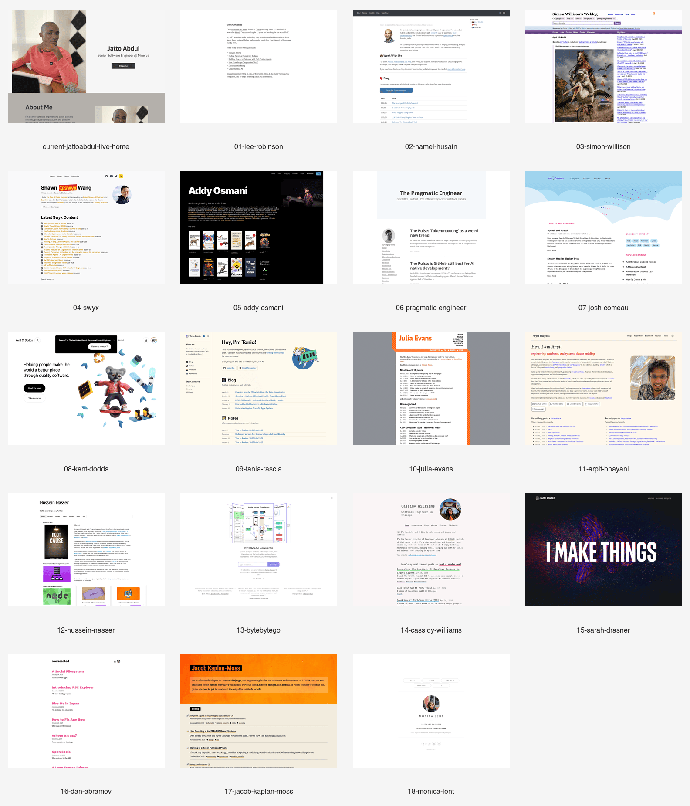
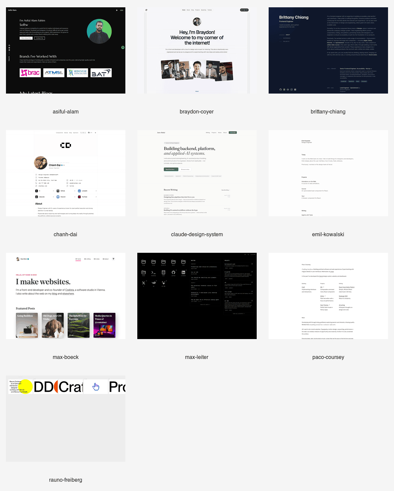

# Engineer-Creator Website Research

Prepared: 2026-04-25 19:52 EDT

Target project: this repository

## Research Goal

Find website examples for engineers who combine senior/staff-level credibility with public writing, teaching, video, newsletter, open-source, or product-building. The goal is not to copy any one site; it is to choose patterns that fit Jatto Abdul's next website.

Useful screenshots:

- [inspiration-contact-sheet.png](../../output/playwright/personal-site-research-2026-04-25/inspiration-contact-sheet.png)
- individual screenshots are in [output/playwright/personal-site-research-2026-04-25](../../output/playwright/personal-site-research-2026-04-25)
- [simple-complex-contact-sheet.png](../../output/playwright/personal-site-research-2026-04-25-addendum/simple-complex-contact-sheet.png)
- addendum screenshots are in [output/playwright/personal-site-research-2026-04-25-addendum](../../output/playwright/personal-site-research-2026-04-25-addendum)

## Best Overall Pattern

The strongest fit is a hybrid of:

- Lee Robinson for minimal personal positioning and curated links
- Hamel Husain for applied-AI authority and consulting/teaching clarity
- Tania Rascia for maintainable blog/notes/projects structure
- Arpit Bhayani for backend/systems credibility and social proof
- Asiful Alam for a Medium-plus-personal-site publishing model and a darker developer portfolio feel
- Josh Comeau or Kent C. Dodds for warmth and teaching personality, used sparingly

Recommended direction:

> A clean technical-editorial site with a strong hero, a writing-first homepage, selected work proof, and a lightweight creator hub.

## Inspiration Matrix

| Person / Site | Positioning | What It Looks Like | Borrow | Be Careful |
| --- | --- | --- | --- | --- |
| [Lee Robinson](https://leerob.com/) | Developer/writer teaching AI; strong company credibility without over-explaining. | Extremely minimal white page, short bio, curated favorite writing, direct links. | Crisp bio, favorite writing list, `read/code/follow/videos` paths. | Too sparse if used alone; Jatto needs stronger project proof. |
| [Hamel Husain](https://hamel.dev/) | Applied AI/evals practitioner, teacher, consultant. | Simple blog homepage with bio, work-with-me block, and long writing archive. | Applied-AI specificity, teaching/consulting clarity, writing as authority. | Very text-heavy; needs warmer visual identity for Jatto. |
| [Simon Willison](https://simonwillison.net/) | Independent technologist with high-frequency notes, links, and tools. | Dense weblog, old-web feel, massive archive, tags, daily publishing rhythm. | Publish notes often; make the site useful as a memory system. | Too dense for first impression unless separated into a `/notes` area. |
| [swyx](https://www.swyx.io/) | AI engineer/community builder/devtools advisor. | Personal homepage with bio, latest content, popular writing, speaking, newsletters. | Strong content hub and explicit topic clusters. | Could feel too busy unless simplified. |
| [Addy Osmani](https://addyosmani.com/) | Senior engineering leader, AI/devtools/books/talks. | Dark premium profile with books, case studies, featured articles, videos, network links. | Leadership credibility modules and featured AI writing. | Too much inventory can overwhelm a newer creator site. |
| [The Pragmatic Engineer](https://blog.pragmaticengineer.com/) | Engineering newsletter/publication. | Publication-first layout with prominent newsletter/book/podcast links. | Treat writing as a product surface; make subscription obvious. | This is more media company than personal portfolio. |
| [Josh Comeau](https://www.joshwcomeau.com/) | Frontend educator with high-craft interactive writing. | Soft playful visuals, clouds, categories, popular content, newsletter, courses. | Warmth, memorable illustration, strong content taxonomy. | Whimsy should be a seasoning, not the main system for Jatto. |
| [Kent C. Dodds](https://kentcdodds.com/) | JavaScript educator and open-source teacher. | Polished educator homepage with video, courses, blog proof, community CTA. | Strong creator CTA stack: blog, course/content, community, newsletter. | Too course-platform-heavy for the first rebuild. |
| [Tania Rascia](https://tania.dev/) | Software engineer, open-source creator, digital garden. | Warm light theme, sidebar, blog/notes/projects/about, newsletter and RSS. | Maintainable structure; separate blogs from notes; clear personal voice. | The anti-AI stance is part of her brand, not Jatto's. |
| [Julia Evans](https://jvns.ca/) | Technical explainer, zines, systems/networking education. | Simple centered blog with orange identity, lists, and links to zines/tools. | Strong color identity and teaching-first archive. | Too intentionally old-school if copied directly. |
| [Arpit Bhayani](https://edge.arpitbhayani.me/) | Principal/staff-level systems engineer, database/distributed systems educator. | Cream editorial page with bio, portrait, social proof, recent posts, papers, courses. | Best match for backend/platform authority plus creator proof. | Social count blocks should wait until they are meaningful. |
| [Hussein Nasser](https://www.husseinnasser.com/p/about-hussein.html) | Backend engineering author, course creator, YouTuber. | Basic Blogger layout, course tiles, about story, backend topic focus. | Narrow topic authority and deep backend content lane. | Visual polish is weak; use topic focus, not the design. |
| [ByteByteGo](https://blog.bytebytego.com/) | System design education/newsletter brand. | Centered newsletter capture, simple promise, testimonials, visual diagrams. | One-line promise and diagram-first technical education. | More brand/publication than personal site. |
| [Cassidy Williams](https://cassidoo.co/) | Software engineer, dev advocacy leader, newsletter/blog/personality. | Tiny personal homepage, friendly bio, recent posts, tags, newsletter. | Casual voice, tags, recent-post stream, open-source transparency. | Too casual if the staff-engineer signal is underdeveloped. |
| [Sarah Drasner](https://sarah.dev/) | Senior engineering leader, speaker, author. | Bold dark visual hero, short nav, high-credibility bio, contact form. | One memorable hero statement and leadership credibility. | Dark/artistic treatment could overpower content manageability. |
| [Dan Abramov / Overreacted](https://overreacted.io/) | Deep React/software thinking through essays. | Minimal blog index with color accent and essay titles. | Let writing carry authority; keep article index fast and clean. | No homepage context for new visitors unless paired with an About section. |
| [Jacob Kaplan-Moss](https://jacobian.org/) | Django co-creator, engineering leader, consultant/writer. | Bold simple header, concise bio, chronological writing list. | Senior credibility in one paragraph; clear writing list. | Topic mix can drift once the brand expands. |
| [Monica Lent](https://monica.carrd.co/) | Software engineer with projects and personal sites. | Minimal Carrd-style profile, short tech stack, project and CV links. | Simple single-page structure and project grouping. | Feels older and less content-led than the target site. |

## Addendum: Asiful Alam And Simple-With-Complexity Sites

This addendum focuses on the kind of developer site that looks simple at first glance but carries extra craft through layout, interaction, content automation, dark mode, or unusually clear information architecture.

| Person / Site | Why It Matters | Borrow | Be Careful |
| --- | --- | --- | --- |
| [Asiful Alam](https://asifulalam.me/) | Dark, simple developer portfolio with a clear personal intro, brand/client proof, contact path, and latest blog section. His Medium article shows a practical path for syncing Medium writing into a personal site. | Medium-backed blog cards, dark mode option, personal portrait, brand proof, direct contact CTA. | His site is more freelance/portfolio than staff-engineer publishing hub; borrow the publishing model and restrained dark aesthetic, not the whole positioning. |
| [Paco Coursey](https://paco.me/) | Ultra-minimal design-engineer page with polished writing, projects, and "now" copy. | Short blocks, tasteful microcopy, compact projects/writing sections, craft without visual noise. | Too minimal alone; Jatto needs stronger engineering proof and blog discoverability. |
| [Emil Kowalski](https://emilkowal.ski/) | Clean design-engineer site with projects, writing, and course/newsletter CTA. | White-space discipline, direct project descriptions, writing archive as authority. | More design-animation focused than backend/platform. |
| [Rauno Freiberg](https://rauno.me/) | Experimental interaction-designer identity with very simple words and rich interaction/visual details. | Memorable mantra-style principles, careful motion, "details matter" feel. | Too abstract for homepage clarity if copied directly. |
| [Braydon Coyer](https://www.braydoncoyer.dev/) | Playful blogfolio that is intentionally over-engineered as a personal sandbox. | Changelog, link previews, experiments, newsletter, personality in the site itself. | Too playful/noisy for staff-engineer credibility if not restrained. |
| [Max Boeck](https://mxb.dev/) | Personal web/developer site with writing, notes, many themes, and a clear old-web/IndieWeb sensibility. | Blog/notes split, theme experimentation, RSS-first mindset. | The visual theme is more front-end/IndieWeb than platform-engineer. |
| [Max Leiter](https://maxleiter.com/) | Dark terminal-like personal hub with blog, notes, projects, labs, and AI/Vercel credibility. | Dense but scannable developer hub, labs/projects separation, technical personality. | Dark terminal aesthetic can become too niche for broad audiences. |
| [Brittany Chiang](https://brittanychiang.com/) | Minimal dark portfolio with polished engineering credibility, experience, projects, writing, and social links. | Clear left/right layout, restrained dark theme, proof-first experience section. | It is still portfolio-first; Jatto needs writing/content to be more central. |
| [Chanh Dai](https://chanhdai.com/) | Resume-like but highly engineered personal site with command palette, components, blog, sponsors, testimonials, contributions, and detailed proof. | "Simple shell, complex internals", command palette, component demos, proof modules, open-source credibility. | Very dense. Use modular ideas, not the entire information load. |

### Medium + Personal Website Blog Model

Asiful's article, [How I Successfully Added Medium Blogs to My Website](https://javascript.plainenglish.io/how-i-successfully-added-medium-blogs-to-my-website-abafd76c4182), is useful because it treats Medium as both a distribution platform and a content source. The practical pattern:

- fetch Medium profile RSS content, optionally through an RSS-to-JSON service
- render recent posts as cards on the personal site
- link to Medium or render a full article page from feed content
- refresh periodically so new Medium posts appear without manual site edits
- keep a clear path back to Medium for followers and engagement

Important constraints:

- Medium's official help confirms profile/publication RSS feeds exist and can be integrated into a website.
- Medium notes that paywalled stories are not available as full stories in RSS feeds.
- Asiful's article reports a practical limit where the Medium RSS feed only exposed the latest 10 items.
- The site should treat the feed as external content with caching, empty states, and failure states rather than relying on client-side fetching at runtime.

Recommended Jatto version:

- Use the personal site as the main reading hub and archive over time.
- Use Medium as distribution or cross-posting, not as the only long-term content database.
- For the first version, show `Latest from Medium` cards sourced from RSS and link out to Medium.
- For the stronger version, ingest Medium RSS server-side into a local cache/content index, preserve source/canonical links, and gradually move evergreen posts into first-party MDX.
- Label external posts clearly: `Published on Medium`.
- Add a `Writing` page with filters for `Essays`, `Notes`, `Medium`, `Videos`, and `Case Studies`.

## Patterns Worth Borrowing

### 1. The One-Sentence Identity

Most strong sites make the visitor understand the person quickly:

- what they do
- what they write or teach about
- why they are credible
- where to go next

For Jatto:

> Senior Software Engineer building backend, platform, and applied-AI systems. I write about practical engineering, AI-assisted product building, and communication for engineers.

### 2. Writing Is The Product

The best creator-engineer sites do not bury writing under `Projects`.

Good patterns:

- latest writing on the homepage
- popular/favorite writing list
- tags or categories
- RSS/newsletter
- notes for shorter posts

For Jatto:

- `Writing`: polished essays
- `Notes`: build logs, short lessons, learning notes
- `Videos`: long-form and shorts linked from YouTube

### 3. Staff Signal Comes From Judgment, Not Title Styling

Staff-level signal should come from:

- systems thinking
- migration and platform stories
- impact under ambiguity
- communication/leadership lessons
- public technical writing
- strong case studies

Do not make the site say `aspiring staff engineer` in the hero. Make the work and writing imply it.

### 4. Creator Signal Needs Clear CTAs

Common CTA paths:

- read the writing
- subscribe to newsletter/RSS
- watch videos
- see projects
- contact/work with me

For Jatto, the homepage should not only say `Resume`. It should give a hiring manager, teammate, learner, or follower a clear next step.

### 5. Visual Polish Should Support Repeat Publishing

The site should be easy to update weekly. That argues for:

- simple cards
- reusable post lists
- structured content data
- restrained visual identity
- no dependence on one-off Canva-style layouts

## Candidate Design Directions

### Direction A: Technical Editorial

References:

- Lee Robinson
- Hamel Husain
- Tania Rascia
- Jacob Kaplan-Moss

Feel:

- clean, readable, professional
- strong on writing and credibility
- easiest to maintain

Best for:

- staff-track positioning
- LinkedIn/blog alignment
- practical engineering essays

### Direction B: Systems Blueprint

References:

- Arpit Bhayani
- ByteByteGo
- Simon Willison
- The Pragmatic Engineer

Feel:

- structured, technical, diagram-friendly
- strong for backend/platform/system design
- good for applied-AI workflows and architecture notes

Best for:

- backend/platform authority
- technical breakdowns
- diagrams and build notes

### Direction C: Warm Product Educator

References:

- Josh Comeau
- Kent C. Dodds
- Cassidy Williams

Feel:

- approachable, creator-first, memorable
- more personality and teaching energy
- good for audience growth

Best for:

- YouTube/blog bridge
- friendly learning content
- career/communication posts

### Direction D: Premium Engineering Leader

References:

- Addy Osmani
- Sarah Drasner

Feel:

- high-status, bold, speaker/author energy
- impressive at first glance

Best for:

- leadership proof
- books/talks/course surfaces later

Risk:

- can become too much about inventory and visual drama before the writing engine exists.

## Recommended Blend

Use:

- 45% Technical Editorial
- 25% Systems Blueprint
- 15% Simple-With-Complexity Developer Craft
- 10% Warm Product Educator
- 5% Premium Engineering Leader

In practice:

- homepage structure from Lee/Hamel/Tania
- backend/platform credibility modules from Arpit
- Medium publishing model and dark developer feel from Asiful
- compact craft/detail inspiration from Paco, Emil, Rauno, Max Leiter, and Chanh Dai
- diagrams and explainers inspired by ByteByteGo
- a little warmth and personality from Josh/Kent/Cassidy
- avoid launching with a dark, high-drama Addy/Sarah-style identity until the content body is stronger

## Homepage Sketch

1. Hero:
   - name
   - role/focus
   - one-sentence creator promise
   - CTAs: `Read writing`, `Watch videos`, `View resume`, `Contact`

2. Latest:
   - 3 latest writing/notes/videos

3. What I Work On:
   - Backend and platform systems
   - Applied-AI workflows
   - Product engineering
   - Engineering communication

4. Selected Proof:
   - Minerva
   - Fera
   - Heroshe
   - Discova
   - TrustKarry

5. Popular/Start Here:
   - 3 evergreen posts once written
   - until then, use planned topics or project writeups

6. Follow/Subscribe:
   - LinkedIn
   - YouTube
   - X
   - GitHub
   - newsletter/RSS when ready

## First Adoption Shortlist

Most useful to adopt:

1. Lee Robinson: minimal first impression and curated writing links.
2. Hamel Husain: applied-AI credibility through practical writing.
3. Tania Rascia: blog/notes/projects information architecture.
4. Arpit Bhayani: backend/platform authority and recent-post proof.
5. Asiful Alam: Medium-backed blog integration and dark developer portfolio restraint.
6. Paco Coursey / Emil Kowalski: simple layout with high craft.
7. Josh Comeau: warmth and memorable teaching energy.

Most useful to discard for now:

- full publication model from The Pragmatic Engineer
- heavy course/community funnel from Kent C. Dodds
- dark premium inventory wall from Addy Osmani
- raw dense weblog homepage from Simon Willison as the main first screen
- old-school single-page CV layout from Monica Lent
- purely client-side Medium fetching without caching, SEO, canonical-link, and failure-state planning

## Sources

- [jattoabdul.com](https://jattoabdul.com)
- [Lee Robinson](https://leerob.com/)
- [Hamel Husain](https://hamel.dev/)
- [Simon Willison](https://simonwillison.net/)
- [swyx](https://www.swyx.io/)
- [Addy Osmani](https://addyosmani.com/)
- [The Pragmatic Engineer](https://blog.pragmaticengineer.com/)
- [Josh Comeau](https://www.joshwcomeau.com/)
- [Kent C. Dodds](https://kentcdodds.com/)
- [Tania Rascia](https://tania.dev/)
- [Julia Evans](https://jvns.ca/)
- [Arpit Bhayani](https://edge.arpitbhayani.me/)
- [Hussein Nasser](https://www.husseinnasser.com/p/about-hussein.html)
- [ByteByteGo](https://blog.bytebytego.com/)
- [Cassidy Williams](https://cassidoo.co/)
- [Sarah Drasner](https://sarah.dev/)
- [Dan Abramov / Overreacted](https://overreacted.io/)
- [Jacob Kaplan-Moss](https://jacobian.org/)
- [Monica Lent](https://monica.carrd.co/)
- [Asiful Alam](https://asifulalam.me/)
- [How I Successfully Added Medium Blogs to My Website](https://javascript.plainenglish.io/how-i-successfully-added-medium-blogs-to-my-website-abafd76c4182)
- [Medium RSS feed help](https://help.medium.com/hc/en-us/articles/214874118-Using-RSS-feeds-of-profiles-publications-and-topics)
- [Paco Coursey](https://paco.me/)
- [Emil Kowalski](https://emilkowal.ski/)
- [Rauno Freiberg](https://rauno.me/)
- [Braydon Coyer](https://www.braydoncoyer.dev/)
- [Max Boeck](https://mxb.dev/)
- [Max Leiter](https://maxleiter.com/)
- [Brittany Chiang](https://brittanychiang.com/)
- [Chanh Dai](https://chanhdai.com/)
